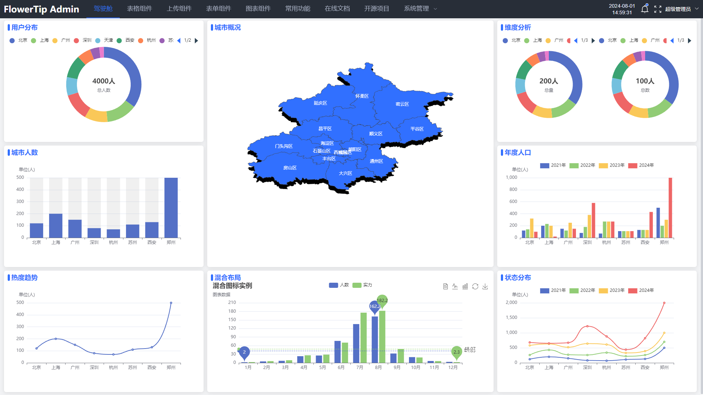
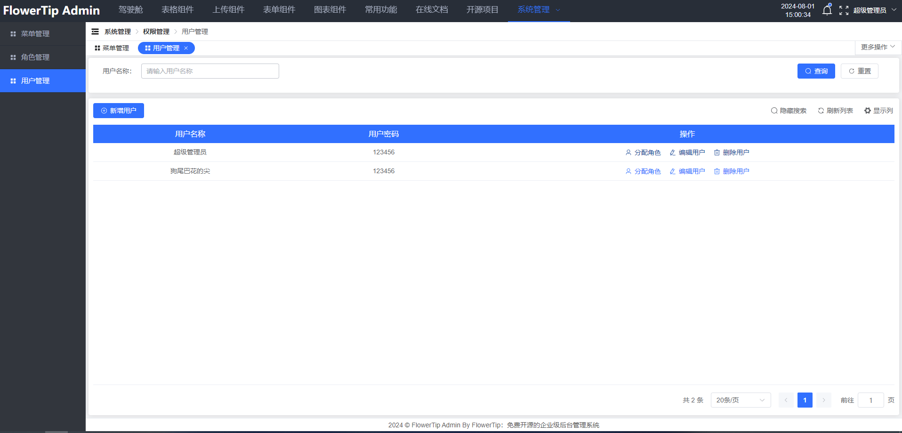
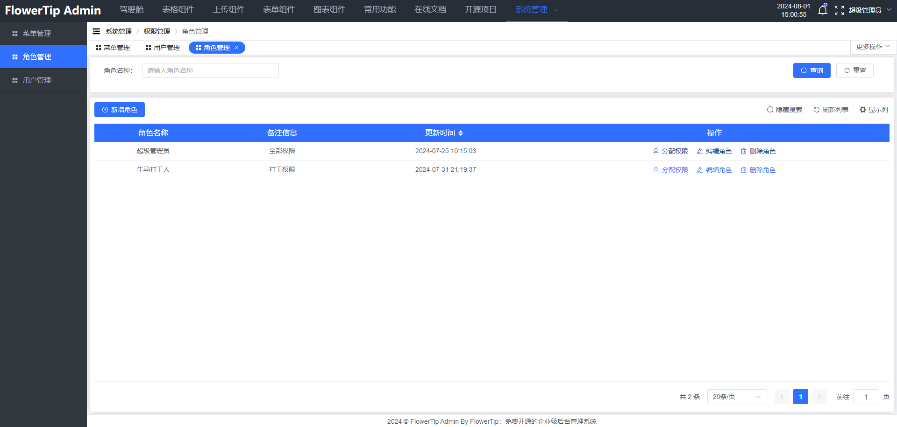
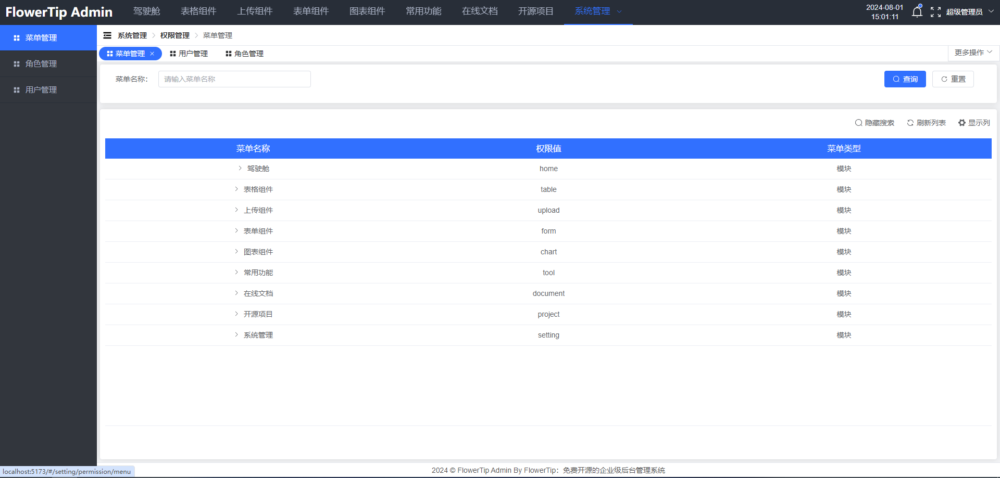
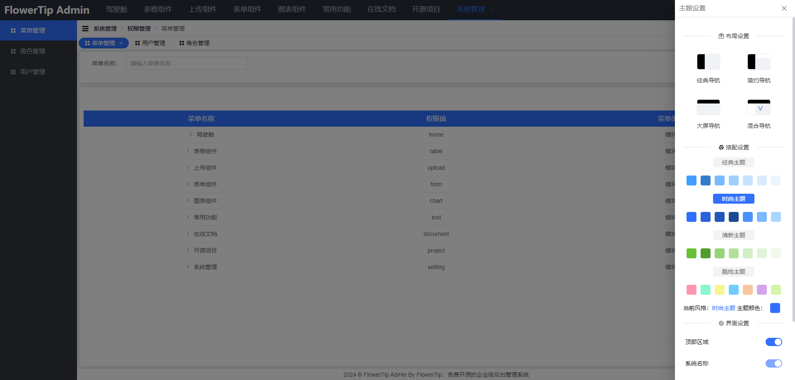

# FlowerTip-Admin-Vue

> 一个基于 Vue3 + TypeScript + Element Plus + Axios + Vue Router@4 + Pina + Vite 开发的企业级后台管理系统

## 项目预览

项目预览地址：https://flowertip.site/admin/#/login
默认填充的有超级管理员的账号密码，直接登录
可以自行添加测试账号，分配权限

## 项目模块

1. 驾驶舱

2. 表格组件

3. 上传组件

4. 表单组件

5. 图表组件

6. 常用功能

7. 在线文档

8. 开源项目

9. 系统管理

## 安装启动

这里推荐的是 `pnpm` 来管理和安装我们的包，Node 环境建议 18 及以上

```bash

1. cd FlowerTip-Admin # 切换到项目目录

2. pnpm install | pnpm i # 安装项目依赖

3. pnpm run dev | pnpm dev # 启动项目

4. pnpm run build:pro | pnpm build:pro # 打包项目进行部署

```

## 项目展示

1. 登录页
   

2. 驾驶舱
   

3. 系统管理

   - 用户管理
     
   - 角色管理
     
   - 菜单管理
     

4. 主题设置
   

## 支持打赏

如果本项目对您有帮助，愿意支持打赏一下作者，可以捐赠一杯咖啡


